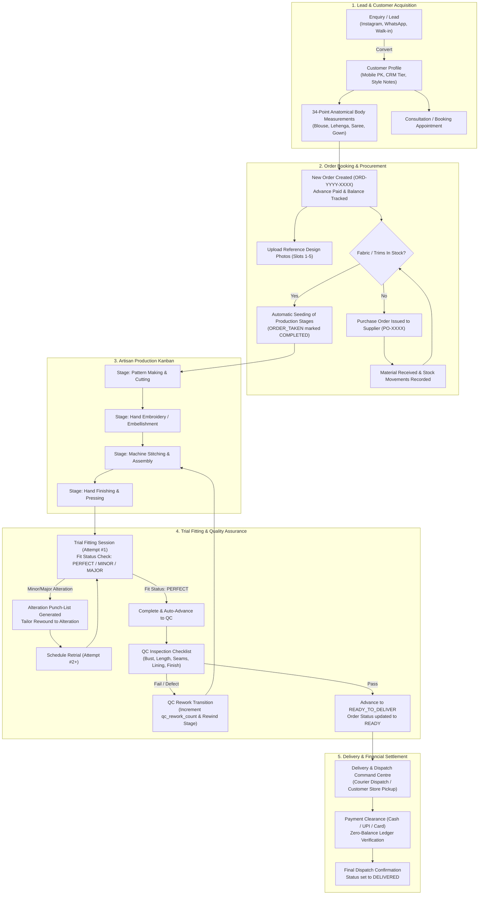
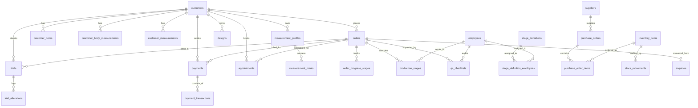

# HAULO BOUTIQUE FASHION ERP — COMPLETE MASTER CODEBASE REFERENCE

**System Name**: Haulo Boutique ERP (Version 1.0)  
**Industry Domain**: Bespoke Tailoring, Luxury Boutique & Garment Manufacturing  
**Backend**: Spring Boot 4.1.1 / Java 17 / PostgreSQL / Hibernate / Flyway / JJWT  
**Frontend**: Modular Pure Vanilla ES6+ JavaScript / CSS3 Design Tokens / HTML5  
**Document Generation Date**: 2026-09-23  

---

## TABLE OF CONTENTS
1. [System Architectural Overview & Design Philosophy](#1-system-architectural-overview--design-philosophy)
2. [End-to-End System Workflow Architecture](#2-end-to-end-system-workflow-architecture)
3. [Database Schema & Complete Relational Model (26 Tables)](#3-database-schema--complete-relational-model-26-tables)
4. [Backend Spring Boot File Catalog (101 Java Files Across 17 Packages)](#4-backend-spring-boot-file-catalog-101-java-files-across-17-packages)
   - 4.1 Root & Configuration (`com.fashionerp`, `config`, `common`)
   - 4.2 Authentication & Security (`auth`)
   - 4.3 Customer CRM & Precision 34-Point Measurements (`customer`)
   - 4.4 Orders Lifecycle & Progress Tracking (`order`)
   - 4.5 Production Kanban & Dynamic Stage Blueprints (`production`)
   - 4.6 Quality Control & Defect Rewind Engine (`production` / `qc`)
   - 4.7 Trial Fittings, Fit Statuses & Alteration Punches (`trial`)
   - 4.8 Inventory, Fabrics, Trims & Stock Ledger Movements (`inventory`)
   - 4.9 Procurement, Purchase Orders & Supplier Directory (`purchase`)
   - 4.10 Payments, Billing & Financial Transactions (`payment`)
   - 4.11 Measurement Profiles & Category Breakdown (`measurement`)
   - 4.12 Workforce, Tailor Capacity & Skills Matrix (`workforce`)
   - 4.13 Design Studio, Sketches & Moodboards (`design`)
   - 4.14 Enquiries & Sales CRM Pipeline (`enquiry`)
   - 4.15 Appointment Scheduling & Booking Calendar (`appointment`)
   - 4.16 Executive Dashboard & Business Health Aggregation (`dashboard`)
5. [Database Migrations & Seed Scripts (27 SQL Files)](#5-database-migrations--seed-scripts-27-sql-files)
6. [Frontend User Interface File Catalog (83 Files Across 17 Modules)](#6-frontend-user-interface-file-catalog-83-files-across-17-modules)
   - 6.1 Unified API Client & Auth Gateway (`front end/api.js`)
   - 6.2 Global Layout Fragments Engine (`fragments/`)
   - 6.3 Global Luxury Theme & Token System (`theme.css`)
   - 6.4 Module-by-Module Breakdown (HTML, CSS, JS)
7. [System Execution, Launchers & Configuration Files](#7-system-execution-launchers--configuration-files)
8. [Cross-Module Execution Lifecycle Scenarios](#8-cross-module-execution-lifecycle-scenarios)

---

## 1. System Architectural Overview & Design Philosophy

Haulo Boutique ERP is engineered for bespoke garment ateliers, luxury fashion houses, and couture tailoring manufacturing. Unlike generic retail ERPs, this platform handles custom body measurements, multiple iterative fitting trials, complex multi-stage garment production (Pattern Cutting, Hand Embroidery, Machine Stitching, Hand Finishing, Quality Control), fabric inventory tracking with textile specs (GSM, Width, Weave, Lot numbers), supplier purchase orders, and dispatch routing.

### Core Architectural Decisions
1. **Stateless RESTful Architecture**: The backend is built on Spring Boot 4.1.1 (Java 17). Every API endpoint under `/api/v1/**` is secured via stateless HMAC-SHA256 JWT tokens with a 24-hour expiration.
2. **Instant Hot Development Reload**: [WebMvcConfig.java](file:///d:/fashion%20ERP/FASHION-ERP/src/main/java/com/fashionerp/config/WebMvcConfig.java) maps the `/front end/**` URL path directly to the local directory on disk. Frontend changes (HTML, CSS, JavaScript) take effect immediately upon browser refresh without needing server restarts or Maven packaging.
3. **Pure Vanilla Frontend without Build-Tools**: The user interface uses native ES6+ modules, standard CSS3 custom properties (`:root`), and semantic HTML5. No Webpack, Vite, or Node compilation is required.
4. **Warm Dark Luxury Aesthetic**: The design system defined in [theme.css](file:///d:/fashion%20ERP/FASHION-ERP/front%20end/fragments/theme/theme.css) features dark tones (`#1F211F`, `#242522`, `#3A3732`), neon-lime brand accents (`#B8FF3D`), soft atmospheric gradients, and frosted glass cards.
5. **Clean Data Model with Flexible Primary Keys**: Customers use their cleaned phone number as their natural primary key, which cascades through orders, measurements, notes, and fittings. Orders and Inventory use UUIDs with human-friendly alphanumeric codes (`ORD-YYYY-XXXX`, `ITEM-XXXX`, `TRL-TIMESTAMP`, `PO-XXXX`).

---

## 2. End-to-End System Workflow Architecture

---

## 3. Database Schema & Complete Relational Model (26 Tables)

The database schema is defined across Flyway migrations `V1` through `V18` targeting PostgreSQL.

### Table Specifications
1. **`customers`** (PK: `mobile_number` VARCHAR(30))
   - Attributes: `name`, `first_name`, `last_name`, `salutation`, `gender`, `email`, `alt_phone`, `instagram_handle`, `preferred_channel`, `dob`, `anniversary`, `location`, `street_address`, `city`, `state`, `pincode`, `landmark`, `avatar_url`, `tier` (REGULAR, SILVER, GOLD, VIP), `total_spend`, `balance`, `credit_limit`, `favorite_garment`, `fit_preference`, `fabric_allergies`, `measurements_on_file`, `notes`, `created_at`, `updated_at`.
2. **`customer_notes`** (PK: `id` UUID)
   - Attributes: `customer_mobile` (FK &rarr; `customers`), `author`, `note_text`, `created_at`.
3. **`customer_body_measurements`** (PK: `id` UUID)
   - 34 Anatomical Points: `customer_mobile` (FK &rarr; `customers`), `customer_name`, `garment_type`, `measurement_type`, `is_current`, `version`, `unit` ('in' / 'cm'), `shoulder`, `bust`, `under_bust`, `waist`, `hip`, `blouse_length`, `top_length`, `full_length`, `skirt_length`, `pant_length`, `armhole`, `upper_arm`, `sleeve_length`, `sleeve_round`, `elbow_round`, `wrist_round`, `front_neck_depth`, `back_neck_depth`, `bust_point`, `apex_to_apex`, `cross_front`, `cross_back`, `crotch_depth`, `thigh_round`, `knee_round`, `calf_round`, `ankle_round`, `notes`, `created_at`, `updated_at`.
4. **`customer_measurements`** (PK: `id` UUID)
   - Key-value legacy measurement pairs: `customer_mobile`, `garment_type`, `measurement_data` (JSON/Text), `created_at`.
5. **`measurement_profiles`** (PK: `id` UUID)
   - Grouping profiles: `customer_mobile` (FK &rarr; `customers`), `profile_name`, `category`, `notes`, `created_at`.
6. **`measurement_points`** (PK: `id` UUID)
   - Granular point items: `profile_id` (FK &rarr; `measurement_profiles`), `point_name`, `point_value`, `unit`.
7. **`orders`** (PK: `id` UUID)
   - Core order header: `order_code` (UNIQUE), `customer_mobile` (FK &rarr; `customers`), `customer_name`, `garment_type`, `garment_desc`, `collection`, `order_date`, `expected_delivery_date`, `delivered_date`, `advance_paid`, `total_amount`, `balance_amount`, `amount`, `status` (PENDING, IN_PROGRESS, READY, DELIVERED, CANCELLED), `current_stage`, `due_date`, `notes`, `production_notes`, `reference_images` (TEXT Array / CSV), `qc_rework_count`, `created_at`, `updated_at`.
8. **`order_progress_stages`** (PK: `id` UUID)
   - Milestone records: `order_id` (FK &rarr; `orders`), `stage`, `completed_at`, `completed_by`, `notes`.
9. **`production_stages`** (PK: `id` UUID)
   - Order Kanban step: `order_id` (FK &rarr; `orders`), `stage_name`, `sort_order`, `status` (NOT_STARTED, IN_PROGRESS, COMPLETED), `assigned_to` (FK &rarr; `employees`), `started_at`, `completed_at`, `notes`, `created_at`.
10. **`stage_definitions`** (PK: `id` UUID)
    - Dynamic stage blueprints: `stage_key` (UNIQUE), `display_name`, `sort_order`, `sla_hours`, `default_role`, `image_url`, `active`, `created_at`.
11. **`stage_definition_employees`** (PK: `id` UUID)
    - Specialist mapping: `stage_def_id` (FK &rarr; `stage_definitions`), `employee_id` (FK &rarr; `employees`).
12. **`qc_checklists`** (PK: `id` UUID)
    - Inspection line items: `order_id` (FK &rarr; `orders`), `check_point`, `sort_order`, `result` (PENDING, PASS, FAIL, REWORK), `remarks`, `checked_by` (FK &rarr; `employees`), `checked_at`.
13. **`trials`** (PK: `id` UUID)
    - Fitting session: `trial_code` (UNIQUE), `order_id` (FK &rarr; `orders`), `order_code`, `customer_mobile` (FK &rarr; `customers`), `customer_name`, `garment_type`, `collection`, `trial_date`, `trial_time`, `stage`, `status` (TODAY, UPCOMING, COMPLETED, RETRIAL_SCHEDULED), `fit_status` (PENDING, PERFECT, MINOR_ALTERATIONS, MAJOR_ALTERATIONS), `trial_attempt`, `alteration_count`, `customer_feedback`, `customer_rating`, `fit_preference`, `fit_checkpoints`, `fit_notes`, `designer_name`, `delivery_date`, `neck_style`, `sleeve_style`, `lining`, `embroidery`, `fabric`, `spec_notes`, `notes`, `created_at`, `updated_at`.
14. **`trial_alterations`** (PK: `id` UUID)
    - Alteration line items: `trial_id` (FK &rarr; `trials`), `area`, `instruction`, `completed` (BOOLEAN), `completed_at`.
15. **`inventory_items`** (PK: `id` UUID)
    - Fabric & trim catalog: `item_code` (UNIQUE), `name`, `category` (Fabric, Lining, Trim, Thread, Lace), `variant`, `unit` (Meter, Yard, Piece), `stock_qty`, `reserved_qty`, `reorder_level`, `purchase_price`, `selling_price`, `status` (IN_STOCK, LOW_STOCK, OUT_OF_STOCK), `composition`, `weave`, `width`, `gsm`, `hsn_code`, `origin`, `location`, `lead_time`, `supplier_name`, `supplier_contact`, `image_url`, `notes`, `created_at`, `updated_at`.
16. **`stock_movements`** (PK: `id` UUID)
    - Stock audit ledger: `item_id` (FK &rarr; `inventory_items`), `movement_type` (RECEIPT, ISSUE, ADJUSTMENT), `quantity`, `reference`, `notes`, `moved_by`, `created_at`.
17. **`suppliers`** (PK: `id` UUID)
    - Vendor profiles: `supplier_code` (UNIQUE), `name`, `contact_person`, `phone`, `email`, `address`, `category`, `payment_terms`, `gstin`, `rating`, `notes`, `created_at`.
18. **`purchase_orders`** (PK: `id` UUID)
    - Procurement order: `po_number` (UNIQUE), `supplier_id` (FK &rarr; `suppliers`), `order_date`, `expected_delivery_date`, `total_amount`, `status` (DRAFT, ORDERED, RECEIVED, CANCELLED), `notes`, `created_at`, `updated_at`.
19. **`purchase_order_items`** (PK: `id` UUID)
    - PO line items: `po_id` (FK &rarr; `purchase_orders`), `item_id` (FK &rarr; `inventory_items`), `quantity_ordered`, `quantity_received`, `unit_price`, `line_total`.
20. **`payments`** (PK: `id` UUID)
    - Order billing header: `order_id` (FK &rarr; `orders`), `customer_mobile` (FK &rarr; `customers`), `total_amount`, `advance_paid`, `balance_amount`, `status` (PENDING, PARTIAL, PAID, REFUNDED), `invoice_number`, `created_at`, `updated_at`.
21. **`payment_transactions`** (PK: `id` UUID)
    - Payment logs: `payment_id` (FK &rarr; `payments`), `amount`, `payment_method` (CASH, CARD, UPI, NET_BANKING), `transaction_ref`, `recorded_by`, `notes`, `created_at`.
22. **`appointments`** (PK: `id` UUID)
    - Booking calendar: `customer_mobile` (FK &rarr; `customers`), `customer_name`, `order_id` (FK &rarr; `orders`), `appointment_type` (CONSULTATION, MEASUREMENT, TRIAL, DELIVERY), `appointment_date`, `time_slot`, `status` (CONFIRMED, COMPLETED, CANCELLED, NO_SHOW), `stylist_notes`, `created_at`.
23. **`enquiries`** (PK: `id` UUID)
    - CRM sales leads: `customer_name`, `phone`, `email`, `garment_type`, `status` (NEW, IN_DISCUSSION, QUOTATION_SENT, CONVERTED, CLOSED), `source` (Instagram, WhatsApp, Walk-in, Referral), `fabric_brought`, `budget`, `follow_up_date`, `notes`, `converted_order_id` (FK &rarr; `orders`), `created_at`, `updated_at`.
24. **`designs`** (PK: `id` UUID)
    - Atelier catalogue: `title`, `design_code`, `category`, `description`, `fabric_recommendations`, `estimated_price`, `tags`, `front_image_url`, `back_image_url`, `customer_mobile` (FK &rarr; `customers`), `order_id` (FK &rarr; `orders`), `created_at`.
25. **`employees`** (PK: `id` UUID)
    - Master artisan roster: `employee_code` (UNIQUE), `name`, `role`, `department` (Cutting, Embroidery, Stitching, Finishing, Quality Control), `phone`, `email`, `hourly_rate`, `daily_capacity_hours`, `status` (ACTIVE, ON_LEAVE, INACTIVE), `avatar_url`, `created_at`.
26. **`app_users`** (PK: `id` UUID)
    - Security accounts: `username` (UNIQUE), `password_hash` (BCrypt cost 12), `full_name`, `email`, `role` (ADMIN, MANAGER, TAILOR, CASHIER), `active` (BOOLEAN), `created_at`.

---

## 4. Backend Spring Boot File Catalog (101 Java Files Across 17 Packages)

### 4.1 System Root & Cross-Cutting Infrastructure
- [FashionErpApplication.java](file:///d:/fashion%20ERP/FASHION-ERP/src/main/java/com/fashionerp/FashionErpApplication.java): Standard Spring Boot initialization class annotated with `@SpringBootApplication`.
- [WebMvcConfig.java](file:///d:/fashion%20ERP/FASHION-ERP/src/main/java/com/fashionerp/config/WebMvcConfig.java): Implements `WebMvcConfigurer`. Directs root URLs (`/`, `/login`, `/dashboard`) to respective HTML views and maps `/front end/**` dynamically to `Paths.get("front end").toAbsolutePath().toUri()`, bypassing the JAR classpath packaging step for real-time frontend CSS/JS editing.
- [SecurityConfig.java](file:///d:/fashion%20ERP/FASHION-ERP/src/main/java/com/fashionerp/config/SecurityConfig.java): `@EnableWebSecurity` component. Sets up `SecurityFilterChain`, disables CSRF for REST stateless calls, establishes `SessionCreationPolicy.STATELESS`, whitelists static assets (`/front end/**`, `/static/**`, `/favicon.ico`) and login (`/api/v1/auth/login`), wires `JwtAuthFilter` before `UsernamePasswordAuthenticationFilter`, configures global CORS, and sets up `BCryptPasswordEncoder(12)`.
- [GlobalExceptionHandler.java](file:///d:/fashion%20ERP/FASHION-ERP/src/main/java/com/fashionerp/common/GlobalExceptionHandler.java): `@RestControllerAdvice` catching `IllegalArgumentException` (returns HTTP 400 Bad Request with JSON payload) and `Exception` (returns HTTP 500 Internal Server Error).

### 4.2 Authentication & Security (`com.fashionerp.auth`)
- [AppUser.java](file:///d:/fashion%20ERP/FASHION-ERP/src/main/java/com/fashionerp/auth/AppUser.java): JPA entity representing system operators. Contains UUID, username, hashed password, role, and active status.
- [AppUserRepository.java](file:///d:/fashion%20ERP/FASHION-ERP/src/main/java/com/fashionerp/auth/AppUserRepository.java): Spring Data JPA repository for user lookup by username.
- [UserRole.java](file:///d:/fashion%20ERP/FASHION-ERP/src/main/java/com/fashionerp/auth/UserRole.java): Enum specifying `ADMIN`, `MANAGER`, `TAILOR`, and `CASHIER`.
- [AuthDto.java](file:///d:/fashion%20ERP/FASHION-ERP/src/main/java/com/fashionerp/auth/AuthDto.java): DTO container with `LoginRequest` (username, password) and `LoginResponse` (token, type, username, fullName, role).
- [AuthService.java](file:///d:/fashion%20ERP/FASHION-ERP/src/main/java/com/fashionerp/auth/AuthService.java): Authenticates user credentials using `PasswordEncoder.matches()`, generates a signed JWT via `JwtUtil`, and returns user session details.
- [JwtUtil.java](file:///d:/fashion%20ERP/FASHION-ERP/src/main/java/com/fashionerp/auth/JwtUtil.java): HMAC-SHA256 JWT utility. Handles secret signing keys, claims creation, subject extraction, expiration checking, and token validation.
- [JwtAuthFilter.java](file:///d:/fashion%20ERP/FASHION-ERP/src/main/java/com/fashionerp/auth/JwtAuthFilter.java): HTTP filter intercepting incoming requests, extracting the `Bearer ` token from `Authorization` header, validating against `JwtUtil`, and setting the authenticated `UsernamePasswordAuthenticationToken` in Spring's `SecurityContextHolder`.
- [AuthController.java](file:///d:/fashion%20ERP/FASHION-ERP/src/main/java/com/fashionerp/auth/AuthController.java): Exposes POST `/api/v1/auth/login` (public) and GET `/api/v1/auth/me` (returns current user profile).

### 4.3 Customer CRM & Precision Measurements (`com.fashionerp.customer`)
- [Customer.java](file:///d:/fashion%20ERP/FASHION-ERP/src/main/java/com/fashionerp/customer/Customer.java): Master customer entity using normalized phone string as `@Id`. Stores name, address, lifestyle attributes, VIP tiers, notes, and fit preferences.
- [CustomerTier.java](file:///d:/fashion%20ERP/FASHION-ERP/src/main/java/com/fashionerp/customer/CustomerTier.java): Enum (`REGULAR`, `SILVER`, `GOLD`, `VIP`).
- [CustomerNote.java](file:///d:/fashion%20ERP/FASHION-ERP/src/main/java/com/fashionerp/customer/CustomerNote.java): Journal entry attached to customer phone.
- [CustomerNoteRepository.java](file:///d:/fashion%20ERP/FASHION-ERP/src/main/java/com/fashionerp/customer/CustomerNoteRepository.java): Finds customer notes ordered by timestamp descending.
- [CustomerBodyMeasurement.java](file:///d:/fashion%20ERP/FASHION-ERP/src/main/java/com/fashionerp/customer/CustomerBodyMeasurement.java): Comprehensive 34-point anatomical measurement record covering Upper Body, Lengths, Arms/Sleeves, Neck Depths, Bust Points, Cross-widths, and Lower Body metrics.
- [CustomerBodyMeasurementRepository.java](file:///d:/fashion%20ERP/FASHION-ERP/src/main/java/com/fashionerp/customer/CustomerBodyMeasurementRepository.java): Custom queries for current active body measurements and version histories by customer and garment.
- [CustomerMeasurement.java](file:///d:/fashion%20ERP/FASHION-ERP/src/main/java/com/fashionerp/customer/CustomerMeasurement.java): Key-value legacy measurement record.
- [CustomerMeasurementRepository.java](file:///d:/fashion%20ERP/FASHION-ERP/src/main/java/com/fashionerp/customer/CustomerMeasurementRepository.java): Legacy measurement repository.
- [CustomerRepository.java](file:///d:/fashion%20ERP/FASHION-ERP/src/main/java/com/fashionerp/customer/CustomerRepository.java): Search queries across names, mobile numbers, emails, and `findByFlexibleMobile` supporting international calling codes (`+91`).
- [CustomerDto.java](file:///d:/fashion%20ERP/FASHION-ERP/src/main/java/com/fashionerp/customer/CustomerDto.java): Request, Response, and Customer 360 summary DTOs.
- [CustomerService.java](file:///d:/fashion%20ERP/FASHION-ERP/src/main/java/com/fashionerp/customer/CustomerService.java): Coordinates customer creation, phone number sanitization, avatar uploads, customer 360 dossiers, notes creation, and measurement versioning.
- [CustomerController.java](file:///d:/fashion%20ERP/FASHION-ERP/src/main/java/com/fashionerp/customer/CustomerController.java): REST endpoints for Customer CRUD, avatar upload, measurement retrieval, and journal notes.

### 4.4 Orders Lifecycle & Progress Tracking (`com.fashionerp.order`)
- [Order.java](file:///d:/fashion%20ERP/FASHION-ERP/src/main/java/com/fashionerp/order/Order.java): Central order ledger entity storing `orderCode`, customer link, garment specifications, amounts, current stage, expected delivery, and reference image paths.
- [OrderStatus.java](file:///d:/fashion%20ERP/FASHION-ERP/src/main/java/com/fashionerp/order/OrderStatus.java): Status enum (`PENDING`, `IN_PROGRESS`, `READY`, `DELIVERED`, `CANCELLED`).
- [ProgressStage.java](file:///d:/fashion%20ERP/FASHION-ERP/src/main/java/com/fashionerp/order/ProgressStage.java): Milestone enum (`ORDER`, `FABRIC_SOURCING`, `PATTERN_MAKING`, `CUTTING`, `STITCHING`, `EMBROIDERY`, `TRIAL`, `FINISHING`, `QC`, `DELIVERED`).
- [OrderProgressStage.java](file:///d:/fashion%20ERP/FASHION-ERP/src/main/java/com/fashionerp/order/OrderProgressStage.java): Historical milestone record with timestamp and notes.
- [OrderProgressStageRepository.java](file:///d:/fashion%20ERP/FASHION-ERP/src/main/java/com/fashionerp/order/OrderProgressStageRepository.java): Finds progress stages for an order.
- [OrderRepository.java](file:///d:/fashion%20ERP/FASHION-ERP/src/main/java/com/fashionerp/order/OrderRepository.java): Order search, code lookups, KPI counters by status.
- [OrderDto.java](file:///d:/fashion%20ERP/FASHION-ERP/src/main/java/com/fashionerp/order/OrderDto.java): Request and Response DTO mappings.
- [OrderService.java](file:///d:/fashion%20ERP/FASHION-ERP/src/main/java/com/fashionerp/order/OrderService.java): Handles order creation, unique code generation (`ORD-YYYY-XXXX`), and **automatically initializes `ProductionStage` records for each active stage definition**, setting `ORDER_TAKEN` to `COMPLETED` and the rest to `NOT_STARTED`.
- [OrderController.java](file:///d:/fashion%20ERP/FASHION-ERP/src/main/java/com/fashionerp/order/OrderController.java): Endpoints for `/api/v1/orders` (list, create, update, KPIs, reference image slot uploads 1-5).

### 4.5 Production Kanban & Quality Control (`com.fashionerp.production`)
- [ProductionStage.java](file:///d:/fashion%20ERP/FASHION-ERP/src/main/java/com/fashionerp/production/ProductionStage.java): Per-order Kanban card stage tracking `stageName`, `sortOrder`, `status` (NOT_STARTED, IN_PROGRESS, COMPLETED), assigned artisan, and start/completion timestamps.
- [ProductionStageRepository.java](file:///d:/fashion%20ERP/FASHION-ERP/src/main/java/com/fashionerp/production/ProductionStageRepository.java): Orders stages by `sortOrder` ascending for an order.
- [StageDefinition.java](file:///d:/fashion%20ERP/FASHION-ERP/src/main/java/com/fashionerp/production/StageDefinition.java): Master workflow step blueprint holding `stageKey`, `displayName`, `sortOrder`, `slaHours`, `defaultRole`, `imageUrl`, and `active`.
- [StageDefinitionDto.java](file:///d:/fashion%20ERP/FASHION-ERP/src/main/java/com/fashionerp/production/StageDefinitionDto.java): DTOs for configuring stage blueprints.
- [StageDefinitionEmployee.java](file:///d:/fashion%20ERP/FASHION-ERP/src/main/java/com/fashionerp/production/StageDefinitionEmployee.java): Mapping between stage definitions and assigned employee specialists.
- [StageDefinitionEmployeeRepository.java](file:///d:/fashion%20ERP/FASHION-ERP/src/main/java/com/fashionerp/production/StageDefinitionEmployeeRepository.java): Repository for assigned stage personnel.
- [StageDefinitionRepository.java](file:///d:/fashion%20ERP/FASHION-ERP/src/main/java/com/fashionerp/production/StageDefinitionRepository.java): Fetches active stage definitions ordered by `sortOrder`.
- [StageDefinitionService.java](file:///d:/fashion%20ERP/FASHION-ERP/src/main/java/com/fashionerp/production/StageDefinitionService.java): Blueprint CRUD, drag-and-drop reordering, pinning artisans, and uploading artwork.
- [ProductionController.java](file:///d:/fashion%20ERP/FASHION-ERP/src/main/java/com/fashionerp/production/ProductionController.java): Endpoints for Kanban stages, stage transitions (`/api/v1/production/transition`), dynamic next-stage calculation, and stage definition setup.
- [QcChecklist.java](file:///d:/fashion%20ERP/FASHION-ERP/src/main/java/com/fashionerp/production/QcChecklist.java): QC criteria checklist holding `checkPoint`, `result` (`PASS`, `FAIL`, `REWORK`, `PENDING`), and notes.
- [QcChecklistRepository.java](file:///d:/fashion%20ERP/FASHION-ERP/src/main/java/com/fashionerp/production/QcChecklistRepository.java): Checklists by order and counts of orders awaiting QC.
- [QcController.java](file:///d:/fashion%20ERP/FASHION-ERP/src/main/java/com/fashionerp/production/QcController.java): QC checklist endpoints, KPI metrics, `/api/v1/qc/pass` (advances order to post-QC stage), and `/api/v1/qc/rework` (increments `qc_rework_count` and rewinds order to a specified prior stage).

### 4.6 Trial Fittings & Alterations (`com.fashionerp.trial`)
- [Trial.java](file:///d:/fashion%20ERP/FASHION-ERP/src/main/java/com/fashionerp/trial/Trial.java): Fitting trial session entity tracking attempt count, fit status (`PENDING`, `PERFECT`, `MINOR_ALTERATIONS`, `MAJOR_ALTERATIONS`), client feedback, and specifications.
- [TrialAlteration.java](file:///d:/fashion%20ERP/FASHION-ERP/src/main/java/com/fashionerp/trial/TrialAlteration.java): Punch-list item for adjustments (`area`, `instruction`, `completed` flag).
- [TrialRepository.java](file:///d:/fashion%20ERP/FASHION-ERP/src/main/java/com/fashionerp/trial/TrialRepository.java): Queries trials by status, date, order, or customer.
- [TrialDto.java](file:///d:/fashion%20ERP/FASHION-ERP/src/main/java/com/fashionerp/trial/TrialDto.java): DTO representations for trials and alteration checklists.
- [TrialService.java](file:///d:/fashion%20ERP/FASHION-ERP/src/main/java/com/fashionerp/trial/TrialService.java): Creates trials, schedules retrials (increments attempt count), toggles alterations, and handles `completeAndAdvance` (auto-triggers transition to QC).
- [TrialController.java](file:///d:/fashion%20ERP/FASHION-ERP/src/main/java/com/fashionerp/trial/TrialController.java): Endpoints for trial scheduling, status updates, alteration toggles, retrial creation, and KPIs.

### 4.7 Inventory, Fabrics & Stock Ledger (`com.fashionerp.inventory`)
- [InventoryItem.java](file:///d:/fashion%20ERP/FASHION-ERP/src/main/java/com/fashionerp/inventory/InventoryItem.java): Fabric / material item with item code, name, category, composition, weave, width, GSM, HSN code, stock quantity, reserved quantity, reorder level, and unit pricing.
- [InventoryStatus.java](file:///d:/fashion%20ERP/FASHION-ERP/src/main/java/com/fashionerp/inventory/InventoryStatus.java): Enum (`IN_STOCK`, `LOW_STOCK`, `OUT_OF_STOCK`).
- [MovementType.java](file:///d:/fashion%20ERP/FASHION-ERP/src/main/java/com/fashionerp/inventory/MovementType.java): Enum (`RECEIPT`, `ISSUE`, `ADJUSTMENT`).
- [StockMovement.java](file:///d:/fashion%20ERP/FASHION-ERP/src/main/java/com/fashionerp/inventory/StockMovement.java): Inventory ledger entry tracking movement type, quantity, reference document, reason, mover name, and timestamp.
- [StockMovementRepository.java](file:///d:/fashion%20ERP/FASHION-ERP/src/main/java/com/fashionerp/inventory/StockMovementRepository.java): Paginated movement history queries.
- [StockMovementDto.java](file:///d:/fashion%20ERP/FASHION-ERP/src/main/java/com/fashionerp/inventory/StockMovementDto.java): DTO for stock movements.
- [InventoryRepository.java](file:///d:/fashion%20ERP/FASHION-ERP/src/main/java/com/fashionerp/inventory/InventoryRepository.java): Stock search and status counting.
- [InventoryDto.java](file:///d:/fashion%20ERP/FASHION-ERP/src/main/java/com/fashionerp/inventory/InventoryDto.java): DTOs for stock items and adjustments.
- [InventoryService.java](file:///d:/fashion%20ERP/FASHION-ERP/src/main/java/com/fashionerp/inventory/InventoryService.java): Stock item CRUD, quantity adjustments, and **automatic ledger entry creation in `StockMovement`**.
- [InventoryController.java](file:///d:/fashion%20ERP/FASHION-ERP/src/main/java/com/fashionerp/inventory/InventoryController.java): Endpoints for inventory listing, adjustments, stock ledger movement history, and KPI aggregates.

### 4.8 Procurement & Suppliers (`com.fashionerp.purchase`)
- [Supplier.java](file:///d:/fashion%20ERP/FASHION-ERP/src/main/java/com/fashionerp/purchase/Supplier.java): Supplier profile (code, name, contact, category, payment terms, GSTIN).
- [SupplierRepository.java](file:///d:/fashion%20ERP/FASHION-ERP/src/main/java/com/fashionerp/purchase/SupplierRepository.java): Supplier search and retrieval.
- [PurchaseOrder.java](file:///d:/fashion%20ERP/FASHION-ERP/src/main/java/com/fashionerp/purchase/PurchaseOrder.java): Purchase order header (PO number, supplier, order date, expected delivery, total amount, status).
- [PurchaseOrderItem.java](file:///d:/fashion%20ERP/FASHION-ERP/src/main/java/com/fashionerp/purchase/PurchaseOrderItem.java): Line item linking to `InventoryItem` with ordered and received quantities.
- [PurchaseOrderRepository.java](file:///d:/fashion%20ERP/FASHION-ERP/src/main/java/com/fashionerp/purchase/PurchaseOrderRepository.java): PO search, filtering by supplier and status.
- [PurchaseController.java](file:///d:/fashion%20ERP/FASHION-ERP/src/main/java/com/fashionerp/purchase/PurchaseController.java): Endpoints for PO management, supplier directory, and procurement KPIs.

### 4.9 Payments & Billing (`com.fashionerp.payment`)
- [Payment.java](file:///d:/fashion%20ERP/FASHION-ERP/src/main/java/com/fashionerp/payment/Payment.java): Billing master for an order (total amount, advance paid, balance amount, status).
- [PaymentTransaction.java](file:///d:/fashion%20ERP/FASHION-ERP/src/main/java/com/fashionerp/payment/PaymentTransaction.java): Transaction record (amount, payment method, transaction reference, date).
- [PaymentMethod.java](file:///d:/fashion%20ERP/FASHION-ERP/src/main/java/com/fashionerp/payment/PaymentMethod.java): Enum (`CASH`, `CARD`, `UPI`, `NET_BANKING`).
- [PaymentStatus.java](file:///d:/fashion%20ERP/FASHION-ERP/src/main/java/com/fashionerp/payment/PaymentStatus.java): Enum (`PENDING`, `PARTIAL`, `PAID`, `REFUNDED`).
- [PaymentRepository.java](file:///d:/fashion%20ERP/FASHION-ERP/src/main/java/com/fashionerp/payment/PaymentRepository.java): Sums paid/pending revenue and aggregates transactions.
- [PaymentDto.java](file:///d:/fashion%20ERP/FASHION-ERP/src/main/java/com/fashionerp/payment/PaymentDto.java): DTO definitions for payments and transactions.
- [PaymentService.java](file:///d:/fashion%20ERP/FASHION-ERP/src/main/java/com/fashionerp/payment/PaymentService.java): Financial processing, recording partial and full payments, recalculating order balances.
- [PaymentController.java](file:///d:/fashion%20ERP/FASHION-ERP/src/main/java/com/fashionerp/payment/PaymentController.java): Payment creation, transaction logging, and revenue KPIs.

### 4.10 Measurement Profiles (`com.fashionerp.measurement`)
- [MeasurementProfile.java](file:///d:/fashion%20ERP/FASHION-ERP/src/main/java/com/fashionerp/measurement/MeasurementProfile.java): Reusable customer measurement container.
- [MeasurementPoint.java](file:///d:/fashion%20ERP/FASHION-ERP/src/main/java/com/fashionerp/measurement/MeasurementPoint.java): Named measurement point with numeric value and unit.
- [MeasurementProfileRepository.java](file:///d:/fashion%20ERP/FASHION-ERP/src/main/java/com/fashionerp/measurement/MeasurementProfileRepository.java): Profile lookups by customer mobile.
- [MeasurementDto.java](file:///d:/fashion%20ERP/FASHION-ERP/src/main/java/com/fashionerp/measurement/MeasurementDto.java): DTO models for profile points and measurements.
- [MeasurementService.java](file:///d:/fashion%20ERP/FASHION-ERP/src/main/java/com/fashionerp/measurement/MeasurementService.java): Measurement profile logic.
- [MeasurementController.java](file:///d:/fashion%20ERP/FASHION-ERP/src/main/java/com/fashionerp/measurement/MeasurementController.java): Measurement endpoints and category breakdown KPIs (Blouse, Chudi, Lehenga, Saree, Gown).

### 4.11 Workforce & Tailor Roster (`com.fashionerp.workforce`)
- [Employee.java](file:///d:/fashion%20ERP/FASHION-ERP/src/main/java/com/fashionerp/workforce/Employee.java): Artisan record (code, name, role, department, phone, status, hourly rate, daily capacity, avatar).
- [EmployeeRepository.java](file:///d:/fashion%20ERP/FASHION-ERP/src/main/java/com/fashionerp/workforce/EmployeeRepository.java): Employee queries and role filtering.
- [EmployeeDto.java](file:///d:/fashion%20ERP/FASHION-ERP/src/main/java/com/fashionerp/workforce/EmployeeDto.java): DTO definitions.
- [EmployeeService.java](file:///d:/fashion%20ERP/FASHION-ERP/src/main/java/com/fashionerp/workforce/EmployeeService.java): Employee management, workload tracking, and avatar handling.
- [EmployeeController.java](file:///d:/fashion%20ERP/FASHION-ERP/src/main/java/com/fashionerp/workforce/EmployeeController.java): Staff directory, capacity tracking, and avatar uploads.

### 4.12 Design Studio (`com.fashionerp.design`)
- [Design.java](file:///d:/fashion%20ERP/FASHION-ERP/src/main/java/com/fashionerp/design/Design.java): Design entity (title, code, category, tags, fabric recommendations, estimated price, front/back image URLs, customer link).
- [DesignRepository.java](file:///d:/fashion%20ERP/FASHION-ERP/src/main/java/com/fashionerp/design/DesignRepository.java): Design searches by category, title, or tags.
- [DesignController.java](file:///d:/fashion%20ERP/FASHION-ERP/src/main/java/com/fashionerp/design/DesignController.java): Design catalogue CRUD, image uploading, and portfolio KPIs.

### 4.13 Enquiries & Sales CRM (`com.fashionerp.enquiry`)
- [Enquiry.java](file:///d:/fashion%20ERP/FASHION-ERP/src/main/java/com/fashionerp/enquiry/Enquiry.java): Lead record (customer name, phone, garment type, status, source channel, fabric brought, budget, next follow-up date).
- [EnquiryRepository.java](file:///d:/fashion%20ERP/FASHION-ERP/src/main/java/com/fashionerp/enquiry/EnquiryRepository.java): Pipeline status counts and lead queries.
- [EnquiryController.java](file:///d:/fashion%20ERP/FASHION-ERP/src/main/java/com/fashionerp/enquiry/EnquiryController.java): Enquiry management, pipeline transitions, conversion to order, and KPI counts.

### 4.14 Appointments & Booking (`com.fashionerp.appointment`)
- [Appointment.java](file:///d:/fashion%20ERP/FASHION-ERP/src/main/java/com/fashionerp/appointment/Appointment.java): Scheduled booking (customer, date, time slot, appointment type, status).
- [AppointmentType.java](file:///d:/fashion%20ERP/FASHION-ERP/src/main/java/com/fashionerp/appointment/AppointmentType.java): Enum (`CONSULTATION`, `MEASUREMENT`, `TRIAL`, `DELIVERY`).
- [AppointmentStatus.java](file:///d:/fashion%20ERP/FASHION-ERP/src/main/java/com/fashionerp/appointment/AppointmentStatus.java): Enum (`CONFIRMED`, `COMPLETED`, `CANCELLED`, `NO_SHOW`).
- [AppointmentRepository.java](file:///d:/fashion%20ERP/FASHION-ERP/src/main/java/com/fashionerp/appointment/AppointmentRepository.java): Date range queries, today's appointments.
- [AppointmentDto.java](file:///d:/fashion%20ERP/FASHION-ERP/src/main/java/com/fashionerp/appointment/AppointmentDto.java): DTO representations.
- [AppointmentService.java](file:///d:/fashion%20ERP/FASHION-ERP/src/main/java/com/fashionerp/appointment/AppointmentService.java): Booking slots, conflicts checking, notifications.
- [AppointmentController.java](file:///d:/fashion%20ERP/FASHION-ERP/src/main/java/com/fashionerp/appointment/AppointmentController.java): Calendar queries, today's appointments, and scheduling.

### 4.15 Executive Dashboard (`com.fashionerp.dashboard`)
- [DashboardController.java](file:///d:/fashion%20ERP/FASHION-ERP/src/main/java/com/fashionerp/dashboard/DashboardController.java): Computes real-time KPI metrics aggregating across customers, orders, payments, inventory, and production stages. Provides monthly revenue trends, order status breakdown percentages, low-stock warnings, and production pipeline pulse.

---

## 5. Database Migrations & Seed Scripts (27 SQL Files)

Located in [src/main/resources/db/migration](file:///d:/fashion%20ERP/FASHION-ERP/src/main/resources/db/migration) and [scripts/](file:///d:/fashion%20ERP/FASHION-ERP/scripts):

- `V1__init_schema.sql`: Consolidated production schema creating all core relational tables with foreign keys and indexes.
- `V2__seed_data.sql`: Base enterprise seed records.
- `V3__extend_designs_table.sql`: Extends design studio attributes (garment category, tags, fabric recommendations, estimated price).
- `V4__seed_designs.sql`: Seeds curated luxury bridal, party-wear, and festive designs.
- `V5__add_order_meta_columns.sql`: Adds metadata columns to orders.
- `V6__sync_order_production_stages.sql`: Synchronizes production stage tables with existing orders.
- `V7__stage_definitions.sql`: Introduces dynamic stage definition blueprints, SLA durations, and default artisan roles.
- `V8__stage_definition_image.sql`: Adds custom image URL column to stage definitions.
- `V9__update_stage_circular_images.sql`: Updates stage definition icon artwork.
- `V10__seed_18_employees.sql`: Seeds 18 specialized employees across cutting, stitching, embroidery, finishing, QC, and management.
- `V11__seed_inventory_suppliers_payments_trials.sql`: Seeds realistic textile inventory, verified suppliers, payment transactions, and trial fittings.
- `V12__workflow_order_taken_and_ready_to_deliver.sql`: Integrates initial ORDER_TAKEN and final READY_TO_DELIVER automation into stage blueprints.
- `V13__add_qc_rework_count.sql`: Adds `qc_rework_count` tracking column to orders.
- `V14__add_trial_feedback_and_fit_fields.sql`: Adds fit status (`PERFECT_FIT`, `MINOR_ALTERATIONS`, `MAJOR_ALTERATIONS`), designer notes, and retrial dates.
- `V15__extend_and_seed_enquiries.sql`: Extends enquiry pipeline attributes (source channel, budget, fabric brought, follow-up dates) and seeds active leads.
- `V16__customer_preferences_and_notes.sql`: Extends customer profile with styling preferences, customer notes journal, and body measurement versioning.
- `V17__extend_inventory_items_specs.sql`: Adds textile specifications (fabric type, width, GSM, color code, roll number, supplier item code, reorder level).
- `V18__refresh_purchase_orders_data.sql`: Refreshes purchase orders with realistic luxury fabric orders, supplier associations, and delivery dates.
- `scripts/clear_all_data.sql`: Safely clears test data across all tables.
- `scripts/seed_30_appointments.sql`: Generates realistic appointment records.
- `scripts/seed_customers_orders_enquiries.sql`: Seeds real client profiles, active couture orders, and pipeline leads.
- `scripts/seed_customer_body_measurements.sql`: Populates realistic 34-point measurement profiles for clients.
- `scripts/seed_employees.sql`: Baseline employee seeding script.
- `scripts/seed_inventory_payments_suppliers_trials.sql`: Seeds fabric rolls, supplier catalogs, transactions, and trial fittings.
- `scripts/update_local_images.sql`: Maps local asset photo URLs into customer, design, and employee records.

---

## 6. Frontend User Interface File Catalog (83 Files Across 17 Modules)

### 6.1 Unified API Client & Core Fragments
- [front end/api.js](file:///d:/fashion%20ERP/FASHION-ERP/front%20end/api.js): Centralized API client. Automatically detects backend origin, handles JWT token expiry and storage (`sessionStorage` / `localStorage`), supports multipart file uploads (`uploadFile`), and wraps all 16 business domain APIs.
- [front end/fragments/fragments.js](file:///d:/fashion%20ERP/FASHION-ERP/front%20end/fragments/fragments.js): Automated fragment injector that loads `sidebar.html`, `navbar.html`, and `footer.html`, activates current navigation items via `data-module`, and manages collapsed sidebar state.
- [front end/fragments/fragments-inline.js](file:///d:/fashion%20ERP/FASHION-ERP/front%20end/fragments/fragments-inline.js): Bundled inline HTML string fallbacks enabling UI loading even on `file://` protocols.
- [front end/fragments/nav.js](file:///d:/fashion%20ERP/FASHION-ERP/front%20end/fragments/nav.js) & [front end/fragments/nav.css](file:///d:/fashion%20ERP/FASHION-ERP/front%20end/fragments/nav.css): Handles sidebar collapsing, mobile drawer menus, user logout, and active badge updates.
- [front end/fragments/theme/theme.css](file:///d:/fashion%20ERP/FASHION-ERP/front%20end/fragments/theme/theme.css): Comprehensive 1,725-line CSS token system defining color gradients, surfaces, glassmorphic cards, typography (Inter), badges, inputs, and modal elevations.
- [front end/fragments/sidebar.html](file:///d:/fashion%20ERP/FASHION-ERP/front%20end/fragments/sidebar.html), [navbar.html](file:///d:/fashion%20ERP/FASHION-ERP/front%20end/fragments/navbar.html), [footer.html](file:///d:/fashion%20ERP/FASHION-ERP/front%20end/fragments/footer.html): Reusable layout components injected into every module.

### 6.2 Module Directory & File Reference
| Module Directory | Files | Primary Responsibility & Features |
| :--- | :--- | :--- |
| **`front end/login/`** | `login.html`, `login.css`, `login.js` | Authentication desk; validates user against `/api/v1/auth/login`, stores JWT token, handles "Remember Me", redirects to dashboard. |
| **`front end/dashboard/`** | `dashboard.html`, `dashboard.css`, `dashboard.js` | Executive command center; live KPI stats, interactive revenue charts, order status distribution donut, and production stage pulse. |
| **`front end/customer/customer-overview/`** | `.html`, `.css`, `.js` | Directory of all clients, search by name/phone, tier filters (VIP/Gold), lifetime spend tags. |
| **`front end/customer/Customer360/`** | `.html`, `.css`, `.js` | Comprehensive client dossier: personal profile, order history, body measurements, alteration logs, styling preferences, and notes. |
| **`front end/customer/new-customer/`** | `.html`, `.css`, `.js` | Onboarding wizard for new clients with anatomical initial measurements, styling preferences, and address validation. |
| **`front end/orders/order-overview/`** | `order-over.html`, `order-over.css`, `order-over.js` | Master orders table; filter by status, delivery countdown alerts, balance payment indicators. |
| **`front end/orders/new-order/`** | `new-order.html`, `new-order.css`, `new-order.js` | Order creation desk; selects customer, garment specs, calculates advance/balance, uploads reference design photos (slots 1-5). |
| **`front end/orders/view-order/`** | `view-order.html`, `view-order.css`, `view-order.js` | Detailed order tracking sheet, production progress history, payment status, reference image previews. |
| **`front end/production/`** | `production.html`, `production.css`, `production.js` | Interactive Production Kanban board; moves garments between stages (Order Taken &rarr; Cutting &rarr; Embroidery &rarr; Stitching &rarr; QC &rarr; Ready). |
| **`front end/production/stages/`** | `stages.html`, `stages.css`, `stages.js` | Production Stage Workflow Designer; allows adding custom production stages, setting SLA hours, assigning specialized tailors, and reordering steps. |
| **`front end/quality-control/`** | `quality-control.html`, `quality-control.css`, `quality-control.js` | QC inspection suite; checklist audit items, Pass QC workflow (advances order), and Rework workflow (increments defect counter and rewinds stage). |
| **`front end/trials-alterations/`** | `trials-alterations.html`, `trials-alterations.css`, `trials-alterations.js` | Fitting trial scheduling, attempt tracking, alteration punch list items, fit rating, and "Complete & Advance to QC" automation. |
| **`front end/delivery/`** | `delivery.html`, `delivery.css`, `delivery.js` | Delivery & Dispatch Command Centre; package ready tracker, courier/pickup management, address validation, dispatch slips, and delivery confirmations. |
| **`front end/inventory/`** | `inventory.html`, `inventory.css`, `inventory.js` | Stock overview; stock levels, low-stock threshold alerts, quick stock adjustments, and stock movement ledger. |
| **`front end/fabrics-materials/`** | `fabrics-materials.html`, `fabrics-materials.css`, `fabrics-materials.js` | Fabric catalog; composition, weave, GSM, width, roll number, supplier traceability. |
| **`front end/purchases/`** | `purchases.html`, `purchases.css`, `purchases.js` | Purchase order management and supplier directory; tracking material orders from PO issue to warehouse receipt. |
| **`front end/payments/`** | `payments.html`, `payments.css`, `payments.js` | Financial desk; payment settlements, receipts, pending balances, transaction records (UPI, Card, Cash). |
| **`front end/Measurements/measurement-overview/`** | `.html`, `.css`, `.js` | Anatomical measurement repository; profiles by client, quick lookup. |
| **`front end/Measurements/measurement360/`** | `.html`, `.css`, `.js` | Visual 360-degree measurement viewer; garment-specific specifications with historical revisions. |
| **`front end/DesignStudio/`** | `design-studio.html`, `design-studio.css`, `design-studio.js` | Creative atelier; sketch lookbook, front/back design cards, category filters, fabric recommendations. |
| **`front end/appointments/`** | `appointments.html`, `appointments.css`, `appointments.js` | Boutique appointment scheduler; calendar slots for consultations, measurements, fittings, and deliveries. |
| **`front end/enquiries/`** | `enquiries.html`, `enquiries.css`, `enquiries.js` | Sales CRM pipeline; leads tracking, channel origin (Instagram, WhatsApp, Walk-in), follow-up dates, and conversion into active orders. |
| **`front end/WorkforceManagement/`** | `workforce.html`, `workforce.css`, `workforce.js` | Master artisan and staff roster; workload allocation, hourly rates, departments, and attendance. |
| **`src/main/resources/static/`** | `index.html`, `index.css`, `index.js` | Legacy landing fallback view. |

---

## 7. System Execution, Launchers & Configuration Files

- [start.bat](file:///d:/fashion%20ERP/FASHION-ERP/start.bat): Enterprise system launcher script. Boots Spring Boot backend on port 8080 via `./mvnw.cmd spring-boot:run`, polls `/actuator/health` asynchronously, and automatically launches Google Chrome directly to the login desk (`http://localhost:8080/front%20end/login/login.html`).
- [pom.xml](file:///d:/fashion%20ERP/FASHION-ERP/pom.xml): Maven configuration specifying Spring Boot 4.1.1, Java 17, Lombok, PostgreSQL driver, Flyway, JJWT, and compiler plugins.
- [application.yaml](file:///d:/fashion%20ERP/FASHION-ERP/src/main/resources/application.yaml): Spring configuration pointing to `jdbc:postgresql://localhost:5432/fashion_erp`, setting HikariCP pool parameters, Flyway baseline settings, port 8080, and debug logging.
- `scratch/*.ps1`: Comprehensive test and validation suite containing 59 PowerShell scripts used during development for database schema verification, CSS color palette normalization, endpoint testing, and workflow transition audits.

---

## 8. Cross-Module Execution Lifecycle Scenarios

### Scenario A: New Bespoke Bridal Order to Delivery
1. Client contacts boutique via Instagram &rarr; [EnquiryController.java](file:///d:/fashion%20ERP/FASHION-ERP/src/main/java/com/fashionerp/enquiry/EnquiryController.java) records lead in `enquiries`.
2. Sales lead is converted to customer in [CustomerService.java](file:///d:/fashion%20ERP/FASHION-ERP/src/main/java/com/fashionerp/customer/CustomerService.java), saving phone number as PK.
3. Master Tailor takes 34-point anatomical body measurements &rarr; saved via `CustomerBodyMeasurementRepository`.
4. Designer creates order in [new-order.js](file:///d:/fashion%20ERP/FASHION-ERP/front%20end/orders/new-order/new-order.js) &rarr; [OrderService.java](file:///d:/fashion%20ERP/FASHION-ERP/src/main/java/com/fashionerp/order/OrderService.java) generates `ORD-2026-XXXX`, records advance payment, and automatically generates `ProductionStage` cards for each active step in `stage_definitions`.
5. Garment moves through stages on the Production Kanban board ([production.js](file:///d:/fashion%20ERP/FASHION-ERP/front%20end/production/production.js)).
6. Trial session is scheduled in [trials-alterations.js](file:///d:/fashion%20ERP/FASHION-ERP/front%20end/trials-alterations/trials-alterations.js).
7. Fitting passes &rarr; `completeAndAdvance` automatically advances the order to Quality Control.
8. QC Lead inspects the garment ([quality-control.js](file:///d:/fashion%20ERP/FASHION-ERP/front%20end/quality-control/quality-control.js)) &rarr; clicks "Pass QC" &rarr; order advances to `READY_TO_DELIVER` and status changes to `READY`.
9. Dispatch Team in Delivery Command Centre ([delivery.js](file:///d:/fashion%20ERP/FASHION-ERP/front%20end/delivery/delivery.js)) processes pickup or courier delivery, collects remaining balance via [payments.js](file:///d:/fashion%20ERP/FASHION-ERP/front%20end/payments/payments.js), and sets order status to `DELIVERED`.
